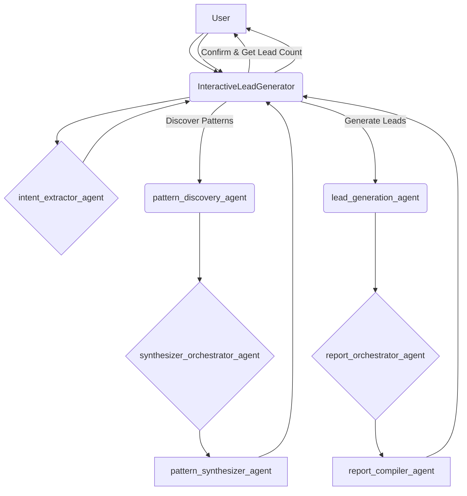

# Interactive Lead Generation Agent

This project is an advanced, interactive lead generation system built on an agentic framework. It intelligently discovers investment patterns from successful companies and uses that knowledge to identify new leads in target markets. The agent is designed to be highly interactive, allowing the user to guide the workflow and make key decisions at critical points.

## Agentic Architecture: Learning and Prediction

The core of this system is its agentic design, which mimics a human research process to learn from the past and predict the future. The workflow is divided into two main phases:

1.  **Pattern Discovery (Learning):** The agent first identifies a set of companies that have recently and successfully invested in the target market. It then researches these companies to understand their "pre-investment signals" - the activities they undertook in the months leading up to their investment. By synthesizing this information, the agent discovers the common patterns and strategies that precede successful market entry.

2.  **Lead Generation (Prediction):** Once the patterns have been discovered and approved by the user, the agent uses this knowledge to find new companies that are currently exhibiting similar signals. This predictive approach allows the agent to identify high-potential leads that are likely to invest in the near future.

## Interactive Workflow

The agent's workflow is designed to be highly interactive, giving the user control over the key decisions:

1.  **Intent Extraction:** The conversation begins with the user stating their goal (e.g., "Find fintech leads in Thailand"). The `intent_extractor_agent` parses this request to identify the target country and industry.

2.  **Pattern Discovery Scope:** The agent asks the user how many companies they want to analyze to discover patterns (1-10).

3.  **Pattern Review and Confirmation:** After the `pattern_discovery_agent` has run, the discovered patterns are presented to the user. The agent then asks for confirmation to proceed with lead generation.

4.  **Lead Generation Scope:** Once the user confirms, the agent asks how many leads they want to find (1-10).

5.  **Final Report:** The `lead_generation_agent` finds the requested number of leads and presents them in a final report, complete with analysis and sources.

## Architecture Diagram

The following diagram illustrates the logical agentic architecture of the system:



### High-Level Workflow


## Component Agents

The system is composed of a hierarchy of specialized agents, each with a specific role:

*   **`InteractiveLeadGenerator` (Root Agent):** The main orchestrator of the entire workflow. It interacts with the user, calls the appropriate sub-agents, and manages the overall state of the conversation.

*   **`intent_extractor_agent`:** A specialized agent responsible for understanding the user's initial request and extracting key information like the target country and industry.

*   **`pattern_discovery_agent`:** An orchestrator agent that manages the pattern discovery process. It uses a set of sub-agents to find and analyze successful companies.
    *   **`company_finder_agent`:** Finds a specified number of companies that have recently invested in the target market.
    *   **`validator_agent`:** Verifies that the found companies meet the specified criteria (e.g., foreign, recent investment).
    *   **`signal_searcher_agent`:** Researches the pre-investment signals of the validated companies.
    *   **`synthesizer_orchestrator_agent`:** Gathers and consolidates the research findings.
    *   **`pattern_synthesizer_agent`:** Analyzes the consolidated findings to identify common patterns and supporting sources.

*   **`lead_generation_agent`:** An orchestrator agent that manages the lead generation process. It uses the discovered patterns to find new leads.
    *   **`lead_finder_agent`:** Finds a specified number of new companies that are exhibiting the discovered patterns.
    *   **`lead_signal_analyzer_agent`:** Analyzes the new leads to identify the specific signals they are showing.
    *   **`report_orchestrator_agent`:** Gathers and consolidates the lead analysis findings.
    *   **`report_compiler_agent`:** Compiles the consolidated findings into a final, human-readable report, complete with analysis and sources.

## Getting Started

### Prerequisites

*   Python 3.9+
*   Access to the Google ADK.
*   A Google Cloud project with the Vertex AI API enabled.
*   An environment file with the necessary API keys and model configurations.

### Installation

1.  **Clone the repository:**
    ```bash
    git clone <your-repository-url>
    cd LeadGenerationResearch
    ```

2.  **Install dependencies using Poetry:**
    ```bash
    pip install poetry
    poetry install
    ```

4.  **Configure your environment:**
    -   Copy the `env_example` file to a new file named `.env`:
        ```bash
        cp env_example .env
        ```
    -   Edit the `.env` file to include your specific project ID and model configurations.

### Configuration

Your `.env` file should contain the following variables:

```
# Environment Variables for Lead Generation Agent
# Copy this file to .env and update with your actual values

# Vertex AI Configuration - REQUIRED
GOOGLE_CLOUD_PROJECT="your-project-id"
GOOGLE_CLOUD_LOCATION="your-location"
GOOGLE_GENAI_USE_VERTEXAI="True"
GOOGLE_CLOUD_STORAGE_BUCKET="your-gcs-bucket-name"

# Model Configuration
# Use a faster model for simple tasks and a more advanced model for complex reasoning.
GEN_FAST_MODEL="gemini-2.0-flash"
GEN_ADVANCED_MODEL="gemini-2.5-pro"

# Deployment Configuration
# The ID of the deployed agent, returned after running `python deployment/deploy.py --create`
REASONING_ENGINE_ID=""
```

### Running the Agent

The agent can be run from the command line using the Google ADK CLI:

```bash
poetry run adk run
```

This will start an interactive chat session where you can begin the lead generation process.

### Example Queries

Here are some examples of how you can interact with the agent:

*   **Simple Request:** "Find fintech leads in Thailand"
*   **More Specific Request:** "I'm looking for companies in the renewable energy sector that have recently invested in Vietnam."
*   **Direct Lead Generation:** "Find me 5 leads for SaaS companies expanding into Brazil."
*   **Follow-up Question:** "Tell me more about the patterns you found for the e-commerce industry in Indonesia."

## Deployment to Agent Engine

To deploy the agent to the Google Cloud Agent Engine, you can use the provided `deploy.py` script.

### Prerequisites

*   Ensure you have authenticated with Google Cloud:
    ```bash
    gcloud auth application-default login
    ```
*   Make sure your `.env` file is populated with your `GOOGLE_CLOUD_PROJECT`, `GOOGLE_CLOUD_LOCATION`, and a `GOOGLE_CLOUD_STORAGE_BUCKET`.

### Deployment Steps

1.  **Create the Agent in the Cloud:**
    ```bash
    poetry run python deployment/deploy.py --create
    ```
    This will create a new agent in the Agent Engine and print the resource name.

2.  **List Agents:**
    ```bash
    poetry run python deployment/deploy.py --list
    ```
    This will list all the agents in your project.

3.  **Delete an Agent:**
    ```bash
    poetry run python deployment/deploy.py --delete --resource_id <your-agent-resource-id>
    ```
    This will delete the specified agent.

### Testing the Deployed Agent

Once your agent is deployed, you can test it using the `test_deploy.py` script.

1.  **Update your `.env` file:**
    -   After running the `deploy.py --create` script, copy the returned resource ID.
    -   Paste the ID into the `REASONING_ENGINE_ID` field in your `.env` file.

2.  **Run the test script:**
    ```bash
    poetry run python deployment/test_deploy.py
    ```

This will start an interactive chat session with your deployed agent.

## Publishing to AgentSpace

After deploying your agent to the Agent Engine, you can publish it to your AgentSpace to make it available to users.

### Prerequisites

*   You have successfully deployed your agent using the `deploy.py` script.
*   You have created an app in your AgentSpace and have the App ID.

### Publishing Steps

1.  **Update your `.env` file:**
    -   Open your `.env` file.
    -   Add a new variable `AGENT_SPACE_ID` and set it to the App ID you created in AgentSpace.

2.  **Run the script:**
    ```bash
    bash publish/publish.sh
    ```

This will publish your agent to the specified AgentSpace.